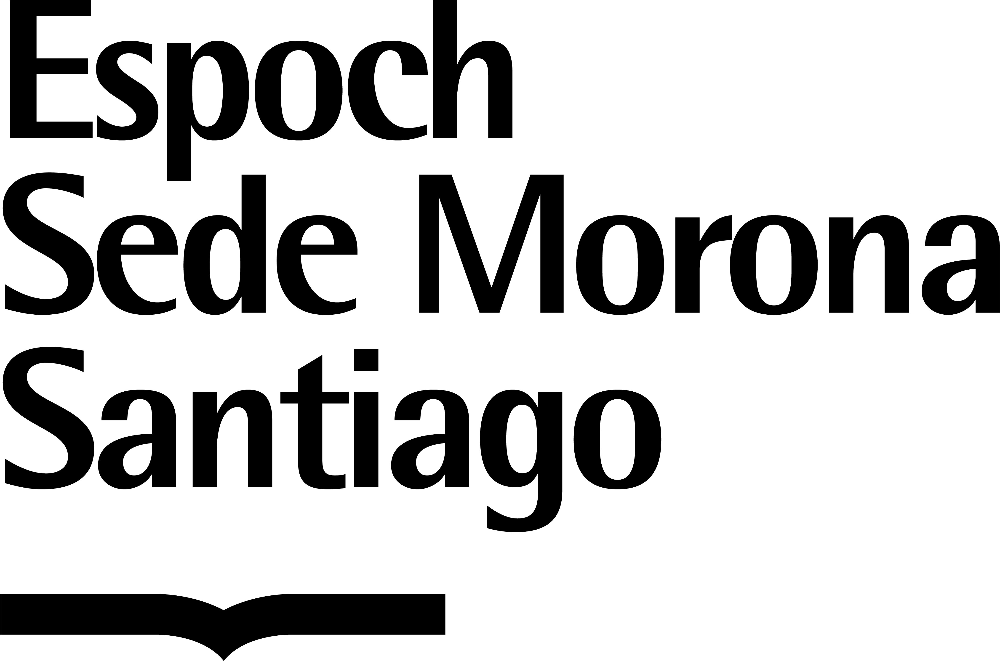
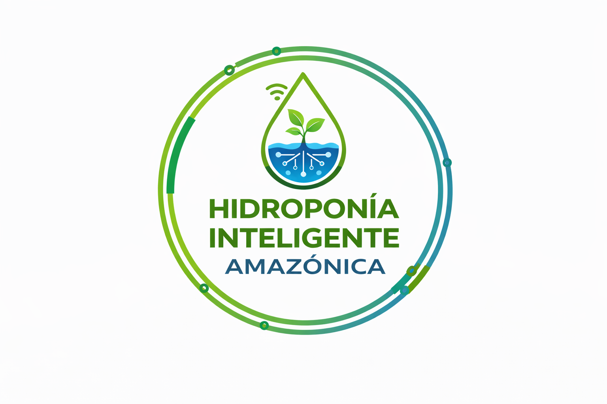
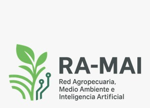

<!DOCTYPE html>
<html lang="es">
<head>
    <meta charset="UTF-8">
    <meta name="viewport" content="width=device-width, initial-scale=1.0">

    <!-- SEO -->
    <title>SMART4GREEN 2026 | I Seminario Multidisciplinario de Innovación para el Desarrollo Sostenible</title>
    <meta name="description" content="SMART4GREEN 2026: 14 ponencias online el 16 y 17 de noviembre y feria presencial de emprendimientos el 17 de noviembre de 09h00 a 13h00. Organiza ESPOCH Sede Morona Santiago.">
    <meta name="keywords" content="SMART4GREEN 2026, desarrollo sostenible, inteligencia artificial, IoT, Amazonía, investigación científica, innovación tecnológica, emprendimiento, sostenibilidad, ESPOCH, Morona Santiago">
    <meta name="author" content="ESPOCH Sede Morona Santiago">
    <meta name="robots" content="index, follow">
    <meta name="theme-color" content="#0E3B2E">
    <link rel="canonical" href="https://smart4green.espoch.edu.ec/">

    <!-- Open Graph -->
    <meta property="og:type" content="website">
    <meta property="og:locale" content="es_EC">
    <meta property="og:url" content="https://smart4green.espoch.edu.ec/">
    <meta property="og:title" content="SMART4GREEN 2026 | I Seminario Multidisciplinario de Innovación para el Desarrollo Sostenible">
    <meta property="og:description" content="16 y 17 de noviembre de 2026. Seminario online y feria presencial de emprendimientos de 09h00 a 13h00.">
    <meta property="og:image" content="https://images.unsplash.com/photo-1518770660439-4636190af475?auto=format&fit=crop&w=1200&q=80">

    <!-- Twitter -->
    <meta name="twitter:card" content="summary_large_image">
    <meta name="twitter:title" content="SMART4GREEN 2026 | I Seminario Multidisciplinario">
    <meta name="twitter:description" content="Seminario online el 16 y 17 de noviembre de 2026; feria presencial de 09h00 a 13h00.">
    <meta name="twitter:image" content="https://images.unsplash.com/photo-1518770660439-4636190af475?auto=format&fit=crop&w=1200&q=80">

    <link rel="icon" href="https://www.espoch.edu.ec/favicon.ico" type="image/x-icon">

    <!-- Datos estructurados del evento (mejoran la presencia en Google) -->
    

    <!-- Fuentes -->
    <link rel="preconnect" href="https://fonts.googleapis.com">
    <link rel="preconnect" href="https://fonts.gstatic.com" crossorigin>
    <link href="https://fonts.googleapis.com/css2?family=Plus+Jakarta+Sans:wght@500;600;700;800&family=Inter:wght@400;500;600&display=swap" rel="stylesheet">

    <!-- Bootstrap 5.3 + Font Awesome 6 -->
    <link href="https://cdn.jsdelivr.net/npm/bootstrap@5.3.2/dist/css/bootstrap.min.css" rel="stylesheet">
    <link rel="stylesheet" href="https://cdnjs.cloudflare.com/ajax/libs/font-awesome/6.4.2/css/all.min.css">

    
</head>
<body class="no-js">
<a class="skip-link" href="#contenido">Saltar al contenido</a>

<!-- BARRA SUPERIOR -->

    

        
<i class="fa-solid fa-graduation-cap me-2" aria-hidden="true"></i>ESPOCH Sede Morona Santiago

        

            <a href="https://sedemacas.espoch.edu.ec/" target="_blank" rel="noopener"><i class="fa-solid fa-globe me-1" aria-hidden="true"></i>sedemacas.espoch.edu.ec</a>
            <a href="https://www.facebook.com/espochms?locale=es_LA" target="_blank" rel="noopener" aria-label="Facebook ESPOCH Sede Morona Santiago"><i class="fa-brands fa-facebook-f" aria-hidden="true"></i></a>
        

    

<!-- NAVEGACIÓN -->
<nav class="navbar navbar-expand-lg sticky-top site-nav" id="siteNav" aria-label="Navegación principal">
    

        <a class="brand" href="#inicio">SMART4GREEN<small>2026 · ESPOCH</small></a>
        <button class="navbar-toggler border-0" type="button" data-bs-toggle="collapse" data-bs-target="#navMenu" aria-controls="navMenu" aria-expanded="false" aria-label="Abrir menú">
            
        </button>
        

            <ul class="navbar-nav ms-auto align-items-lg-center gap-lg-1">
                <li class="nav-item"><a class="nav-link" href="#acerca">Acerca</a></li>
                <li class="nav-item"><a class="nav-link" href="#ejes">Ejes</a></li>
                <li class="nav-item"><a class="nav-link" href="#speakers">Conferencistas</a></li>
                <li class="nav-item"><a class="nav-link" href="#fechas">Fechas</a></li>
                <li class="nav-item"><a class="nav-link" href="#emprendimiento">Feria</a></li>
                <li class="nav-item"><a class="nav-link" href="#programa">Programa</a></li>
                <li class="nav-item"><a class="nav-link" href="#contacto">Contacto</a></li>
                <li class="nav-item ms-lg-3 mt-2 mt-lg-0">
                    <a href="#emprendimiento" class="btn btn-brand py-2 px-3">Feria de emprendimientos</a>
                </li>
            </ul>
        

    

</nav>

<main id="contenido">

<!-- HERO -->
<header id="inicio" class="hero">
    

        

            

                <i class="fa-solid fa-leaf" aria-hidden="true"></i>I Edición · 16 y 17 de noviembre de 2026
                <h1>SMART4GREEN 2026</h1>
                
I Seminario Multidisciplinario de Innovación para el Desarrollo Sostenible

                
Tecnología · Producción · Economía · Sociedad · Ambiente

                

                    <a href="https://forms.gle/oieuCepQ93R2p2tTA" target="_blank" rel="noopener noreferrer" class="btn btn-gold btn-lg">
                        Inscripción general <i class="fa-solid fa-arrow-right ms-2" aria-hidden="true"></i>
                    </a>
                    <a href="#programa" class="btn btn-ghost btn-lg">Ver programa</a>
                

            

            

                

                    <dl class="mb-4">
                        

                            <i class="fa-solid fa-video" aria-hidden="true"></i>
                            
<dt>Seminario online</dt><dd>16 y 17 de noviembre · 14 ponencias</dd>

                        

                        

                            <i class="fa-solid fa-store" aria-hidden="true"></i>
                            
<dt>Feria presencial</dt><dd>Martes 17 · 09h00–13h00 · Lugar por confirmar</dd>

                        

                        

                            <i class="fa-solid fa-location-dot" aria-hidden="true"></i>
                            
<dt>Organiza</dt><dd>ESPOCH Sede Morona Santiago · Macas</dd>

                        

                    </dl>
                    
Faltan

                    

                        
<strong id="days">00</strong>Días

                        
<strong id="hours">00</strong>Horas

                        
<strong id="minutes">00</strong>Min

                        
<strong id="seconds">00</strong>Seg

                    

                

            

        

    

</header>

<!-- DATOS CLAVE -->
<section class="facts" aria-label="Datos clave">
    

        

            

<i class="fa-regular fa-calendar" aria-hidden="true"></i>
<strong>16–17 nov. 2026</strong><small>Dos jornadas</small>

            

<i class="fa-solid fa-laptop" aria-hidden="true"></i>
<strong>Modalidad híbrida</strong><small>Online + feria presencial</small>

            

<i class="fa-solid fa-microchip" aria-hidden="true"></i>
<strong>IA e IoT</strong><small>Aplicados a la sostenibilidad</small>

            

<i class="fa-solid fa-people-arrows" aria-hidden="true"></i>
<strong>Networking académico</strong><small>Investigación y empresa</small>

        

    

</section>

<!-- ACERCA -->
<section id="acerca" class="section">
    

        

            

                Sobre el evento
                <h2 class="section-title">Investigación científica al servicio de la sostenibilidad amazónica</h2>
                

                    <strong>SMART4GREEN 2026</strong> es un espacio multidisciplinario e internacional que articula la investigación académica con el desarrollo sostenible, en diálogo entre el contexto global y la realidad regional amazónica.
                

                

                    A lo largo de dos jornadas, investigadores, docentes, estudiantes, profesionales y emprendedores comparten avances, experiencias y propuestas en tecnología, ambiente, producción, economía y sociedad, con el propósito de generar soluciones innovadoras para el territorio.
                

                

                    <i class="fa-solid fa-building-columns" aria-hidden="true"></i>
                    

                        <h3>Organiza</h3>
                        
Escuela Superior Politécnica de Chimborazo (ESPOCH) · Sede Morona Santiago

                    

                

            

            

                

                    Dirigido a
                    <h3 class="h4 fw-bold mb-4">Público objetivo</h3>
                    

                        
<i class="fa-solid fa-user-graduate" aria-hidden="true"></i><strong>Investigadores y docentes</strong>

                        
<i class="fa-solid fa-book-open-reader" aria-hidden="true"></i><strong>Estudiantes</strong>

                        
<i class="fa-solid fa-briefcase" aria-hidden="true"></i><strong>Profesionales y empresas</strong>

                        
<i class="fa-solid fa-building-columns" aria-hidden="true"></i><strong>Instituciones públicas y privadas</strong>

                    

                

            

        

    

</section>

<!-- EJES TEMÁTICOS -->
<section id="ejes" class="section section-alt">
    

        

            Áreas de investigación
            <h2 class="section-title">Siete ejes temáticos</h2>
            
Las ponencias se organizan en siete líneas que conectan tecnología, territorio, economía y sociedad.

        

        

            
<article class="axis-card">
                
<i class="fa-solid fa-robot" aria-hidden="true"></i>EJE 01

                <h3>Tecnología, IA y digitalización</h3>
                
Inteligencia artificial, Internet de las Cosas, transformación digital y Big Data aplicados al desarrollo.

            </article>

            
<article class="axis-card">
                
<i class="fa-solid fa-leaf" aria-hidden="true"></i>EJE 02

                <h3>Ambiente y sostenibilidad</h3>
                
Monitoreo ambiental, conservación de la biodiversidad, cambio climático y resiliencia ecológica.

            </article>

            
<article class="axis-card">
                
<i class="fa-solid fa-gem" aria-hidden="true"></i>EJE 03

                <h3>Recursos naturales y territorio</h3>
                
Minería responsable, gestión territorial sostenible y preservación de cuencas hidrográficas.

            </article>

            
<article class="axis-card">
                
<i class="fa-solid fa-wheat-awn" aria-hidden="true"></i>EJE 04

                <h3>Producción y zootecnia</h3>
                
Agropecuaria de precisión y sistemas agroforestales sostenibles.

            </article>

            
<article class="axis-card">
                
<i class="fa-solid fa-chart-line" aria-hidden="true"></i>EJE 05

                <h3>Economía y negocios sostenibles</h3>
                
Economía circular, contabilidad, finanzas verdes y modelos de negocio sustentables.

            </article>

            
<article class="axis-card">
                
<i class="fa-solid fa-scale-balanced" aria-hidden="true"></i>EJE 06

                <h3>Derecho, sociedad y gobernanza</h3>
                
Políticas públicas, bioética, gobernanza territorial y legislación ambiental.

            </article>

            
<article class="axis-card featured">
                

                    

                        
<i class="fa-solid fa-rocket" aria-hidden="true"></i>EJE 07

                        <h3>Innovación, emprendimiento y desarrollo sostenible</h3>
                        
Transferencia tecnológica, incubación de empresas sostenibles y soluciones innovadoras para comunidades amazónicas.

                    

                    

                        <a href="#emprendimiento" class="btn btn-gold">Conoce la feria <i class="fa-solid fa-arrow-right ms-2" aria-hidden="true"></i></a>
                    

                

            </article>

        

    

</section>

<!-- CONFERENCISTAS -->
<section id="speakers" class="section">
    

        

            Keynote speakers
            <h2 class="section-title">Conferencistas invitados</h2>
            
La asignación de horarios y temas se confirmará en el programa académico.

        

        

            

                <article class="speaker">
                    

                        
                        🇮🇹 Italia
                    

                    

                        <h3>Ing. Omar Delgado, PhD.</h3>
                        
Università della Calabria

                        
<strong>Especialidad:</strong> Inteligencia artificial, sistemas inteligentes, transformación digital y tecnologías emergentes.

                    

                </article>
            

            

                <article class="speaker">
                    
<i class="fa-solid fa-user placeholder" aria-hidden="true"></i>

                    

                        Por confirmar
                        <h3>Conferencista invitado</h3>
                        
Afiliación por confirmar

                        
<strong>Tema:</strong> Por confirmar.

                    

                </article>
            

            

                <article class="speaker">
                    
<i class="fa-solid fa-user placeholder" aria-hidden="true"></i>

                    

                        Por confirmar
                        <h3>Conferencista invitado</h3>
                        
Afiliación por confirmar

                        
<strong>Tema:</strong> Por confirmar.

                    

                </article>
            

        

    

</section>

<!-- FECHAS -->
<section id="fechas" class="section section-alt">
    

        

            Calendario
            <h2 class="section-title">Dos jornadas de intercambio académico</h2>
        

        

            

                

                    

                        
NOV<strong>16</strong>

                        
<h3>Lunes 16 de noviembre</h3><small>Jornada 1</small>

                    

                    
Online
<strong>08h00 – 12h00 y 14h00 – 18h00</strong>
Registro, inauguración y ponencias de los ejes 1 al 6.

                

            

            

                

                    

                        
NOV<strong>17</strong>

                        
<h3>Martes 17 de noviembre</h3><small>Jornada 2</small>

                    

                    
Presencial
<strong>09h00 – 13h00</strong>
Feria de Emprendimientos · Lugar por confirmar.

                    
Online
<strong>15h00 – 17h00</strong>
Ponencias del eje 7, conclusiones y clausura.

                

            

        

    

</section>

<!-- FERIA DE EMPRENDIMIENTOS -->
<section id="emprendimiento" class="section">
    

        

            

                

                    I Feria de Emprendimientos SMART4GREEN 2026
                    <h2 class="section-title">Convierte una idea en una solución para el futuro</h2>
                    
Un espacio para presentar ideas de negocio, proyectos innovadores y soluciones con potencial de impacto, vinculadas con la sostenibilidad, la tecnología, la producción, la economía, la sociedad y el ambiente.

                    

                        <i class="fa-regular fa-calendar me-1" aria-hidden="true"></i>17 de noviembre
                        <i class="fa-regular fa-clock me-1" aria-hidden="true"></i>09h00–13h00
                        <i class="fa-solid fa-location-dot me-1" aria-hidden="true"></i>Presencial · lugar por confirmar
                        <i class="fa-solid fa-users me-1" aria-hidden="true"></i>Equipos de hasta 4 integrantes
                    

                    <h3 class="h6 fw-bold text-uppercase mb-3" style="letter-spacing:.1em">Áreas de participación</h3>
                    <ul class="fair-areas">
                        <li>Sostenibilidad y ambiente</li>
                        <li>Tecnología e innovación</li>
                        <li>Producción y agroindustria</li>
                        <li>Minería sostenible</li>
                        <li>Economía y negocios</li>
                        <li>Innovación social y jurídica</li>
                    </ul>
                    
Pueden participar estudiantes, docentes, investigadores y emprendedores.

                

                

                    

                        <i class="fa-solid fa-circle me-1" style="font-size:.5rem;vertical-align:middle" aria-hidden="true"></i>Inscripciones abiertas
                        <h3 class="mb-3">¿Cómo participar?</h3>
                        
1
Descarga el formato obligatorio y redacta tu propuesta ejecutiva.

                        
2
Guárdala en PDF.

                        
3
Completa el formulario de inscripción y adjunta el PDF. Google puede pedirte iniciar sesión para subir el archivo.

                        

                            <a href="https://forms.gle/fv8FkEfTR3pD16yw5" target="_blank" rel="noopener noreferrer" class="btn btn-brand">
                                Inscribirme en la feria <i class="fa-solid fa-arrow-up-right-from-square ms-2" aria-hidden="true"></i>
                            </a>
                            <a href="documentos/Plantilla_Feria_Emprendimientos_SMART4GREEN_2026.docx" class="btn btn-outline-brand" download>
                                <i class="fa-solid fa-file-word me-2" aria-hidden="true"></i>Descargar formato
                            </a>
                        

                    

                

            

        

    

</section>

<!-- PROGRAMA -->
<section id="programa" class="section section-alt">
    

        

            16 y 17 de noviembre · Hora de Ecuador (UTC−5)
            <h2 class="section-title">Programa de ponencias</h2>
            
14 ponencias de 30 minutos en modalidad online, organizadas en siete ejes temáticos. Los nombres de los conferencistas y los títulos se actualizarán conforme se confirme su participación.

        

        

            <ul class="nav program-tabs" role="tablist">
                <li class="nav-item" role="presentation"><button class="nav-link active" id="tab-d1" data-bs-toggle="tab" data-bs-target="#dia1" type="button" role="tab" aria-controls="dia1" aria-selected="true">Día 1 · Lun 16</button></li>
                <li class="nav-item" role="presentation"><button class="nav-link" id="tab-d2" data-bs-toggle="tab" data-bs-target="#dia2" type="button" role="tab" aria-controls="dia2" aria-selected="false">Día 2 · Mar 17</button></li>
            </ul>
        

        

            <!-- DÍA 1 -->
            

                

                    
<time>08:00 – 09:00</time><strong>Registro e inauguración del I Seminario SMART4GREEN 2026</strong>

                    
<h4>Eje 1 · Tecnología, IA y digitalización</h4>
Inteligencia artificial, IoT, transformación digital y Big Data aplicados al desarrollo.

                    
<time>09:00 – 09:30</time>
<strong>Ponencia 1</strong>Conferencista y tema por confirmar

                    
<time>09:30 – 10:00</time>
<strong>Ponencia 2</strong>Conferencista y tema por confirmar

                    
<time>10:00 – 10:30</time>
<strong>Ponencia 3</strong>Conferencista y tema por confirmar

                    
<time>10:30 – 11:00</time><strong><i class="fa-solid fa-mug-hot me-2" aria-hidden="true"></i>Receso</strong>

                    
<h4>Eje 2 · Ambiente y sostenibilidad</h4>
Monitoreo ambiental, conservación de la biodiversidad, cambio climático y resiliencia ecológica.

                    
<time>11:00 – 11:30</time>
<strong>Ponencia 4</strong>Conferencista y tema por confirmar

                    
<time>11:30 – 12:00</time>
<strong>Ponencia 5</strong>Conferencista y tema por confirmar

                    
<time>12:00 – 14:00</time><strong><i class="fa-solid fa-utensils me-2" aria-hidden="true"></i>Receso para el almuerzo</strong>

                    
<h4>Eje 3 · Recursos naturales y territorio</h4>
Minería responsable, gestión territorial sostenible y preservación de cuencas hidrográficas.

                    
<time>14:00 – 14:30</time>
<strong>Ponencia 6</strong>Conferencista y tema por confirmar

                    
<time>14:30 – 15:00</time>
<strong>Ponencia 7</strong>Conferencista y tema por confirmar

                    
<h4>Eje 4 · Producción y zootecnia</h4>
Agropecuaria de precisión y sistemas agroforestales sostenibles.

                    
<time>15:00 – 15:30</time>
<strong>Ponencia 8</strong>Conferencista y tema por confirmar

                    
<time>15:30 – 16:00</time>
<strong>Ponencia 9</strong>Conferencista y tema por confirmar

                    
<time>16:00 – 16:30</time><strong><i class="fa-solid fa-mug-hot me-2" aria-hidden="true"></i>Receso</strong>

                    
<h4>Eje 5 · Economía y negocios sostenibles</h4>
Economía circular, contabilidad, finanzas verdes y modelos de negocio sustentables.

                    
<time>16:30 – 17:00</time>
<strong>Ponencia 10</strong>Conferencista y tema por confirmar

                    
<time>17:00 – 17:30</time>
<strong>Ponencia 11</strong>Conferencista y tema por confirmar

                    
<h4>Eje 6 · Derecho, sociedad y gobernanza</h4>
Políticas públicas, bioética, gobernanza territorial y legislación ambiental.

                    
<time>17:30 – 18:00</time>
<strong>Ponencia 12</strong>Conferencista y tema por confirmar

                    
<time>18:00</time><strong>Cierre de la primera jornada</strong>

                

            

            <!-- DÍA 2 -->
            

                

                    
<time>09:00 – 13:00</time>
<strong>Feria de Emprendimientos SMART4GREEN 2026</strong>Presencial · lugar por confirmar

                    
<time>13:00 – 15:00</time><strong><i class="fa-solid fa-utensils me-2" aria-hidden="true"></i>Receso</strong>

                    
<h4>Eje 7 · Innovación, emprendimiento y desarrollo sostenible</h4>
Transferencia tecnológica, incubación de empresas sostenibles y soluciones innovadoras para comunidades amazónicas.

                    
<time>15:00 – 15:30</time>
<strong>Ponencia 13</strong>Conferencista y tema por confirmar

                    
<time>15:30 – 16:00</time>
<strong>Ponencia 14</strong>Conferencista y tema por confirmar

                    
<time>16:00 – 16:30</time><strong>Conclusiones del I Seminario SMART4GREEN 2026</strong>

                    
<time>16:30 – 17:00</time><strong>Clausura y cierre oficial del evento</strong>

                

            

        

    

</section>

<!-- CIFRAS -->
<section class="stats" aria-label="El evento en cifras">
    

        

            

14

Ponencias programadas

            

7

Ejes temáticos

            

2

Jornadas académicas

            

1

Feria de emprendimientos

        

    

</section>

<!-- ORGANIZADORES -->
<section id="organizadores" class="section">
    

        

            Respaldo institucional
            <h2 class="section-title">Organizadores y redes académicas</h2>
        

        <!-- Guarde los logos en assets/logos/ con los nombres indicados en cada src. -->
        <h3 class="group-title">Institución organizadora</h3>
        

            

                <article class="partner">
                    

                        
                        <i class="fa-solid fa-building-columns" aria-hidden="true"></i>
                    

                    <h3>Escuela Superior Politécnica de Chimborazo</h3>
                    
Sede Morona Santiago

                </article>
            

        

        <!--
            ENLACES DE PROYECTOS Y REDES
            Escriba la dirección web de cada uno en el atributo href (donde dice href="").
            Mientras un href esté vacío, la tarjeta se muestra normal pero sin enlace.
        -->
        <h3 class="group-title">Proyectos participantes</h3>
        

            

                <!-- URL del Proyecto de investigación -->
                <a class="partner-link" href="https://www.instagram.com/amazonaiot/" target="_blank" rel="noopener noreferrer">
                    <article class="partner">
                        

                            
                            <i class="fa-solid fa-diagram-project" aria-hidden="true"></i>
                        

                        <h3>Proyecto de investigación</h3>
                        
Desarrollo e implementación de un Sistema Inteligente de Monitoreo de la Calidad Ambiental en Ecosistemas Amazónicos mediante Tecnologías IoT e Inteligencia Artificial.

                        Visitar sitio <i class="fa-solid fa-arrow-up-right-from-square ms-1" aria-hidden="true"></i>
                    </article>
                </a>
            

            

                <!-- URL del Proyecto de vinculación (Hidroponía Inteligente Amazónica) -->
                <a class="partner-link" href="https://www.instagram.com/amazonaiot/" target="_blank" rel="noopener noreferrer">
                    <article class="partner">
                        

                            
                            <i class="fa-solid fa-seedling" aria-hidden="true"></i>
                        

                        <h3>Proyecto de vinculación</h3>
                        
Hidroponía Inteligente Amazónica.

                        Visitar sitio <i class="fa-solid fa-arrow-up-right-from-square ms-1" aria-hidden="true"></i>
                    </article>
                </a>
            

        

        <h3 class="group-title">Redes y grupos de investigación</h3>
        

            

                <!-- URL de la Red RAMAI -->
                <a class="partner-link" href="" target="_blank" rel="noopener noreferrer">
                    <article class="partner">
                        

                            
                            <i class="fa-solid fa-network-wired" aria-hidden="true"></i>
                        

                        <h3>Red RAMAI</h3>
                        
Red Agropecuaria, Medio Ambiente e Inteligencia Artificial

                        Visitar sitio <i class="fa-solid fa-arrow-up-right-from-square ms-1" aria-hidden="true"></i>
                    </article>
                </a>
            

            

                <!-- URL del grupo IITMS -->
                <a class="partner-link" href="" target="_blank" rel="noopener noreferrer">
                    <article class="partner">
                        

                            
                            <i class="fa-solid fa-microscope" aria-hidden="true"></i>
                        

                        <h3>IITMS</h3>
                        
Grupo de Investigación Innovación y Tecnología Morona Santiago

                        Visitar sitio <i class="fa-solid fa-arrow-up-right-from-square ms-1" aria-hidden="true"></i>
                    </article>
                </a>
            

            

                <!-- URL del grupo AMAZONAIOT -->
                <a class="partner-link" href="https://www.instagram.com/emprendimientosms2026/" target="_blank" rel="noopener noreferrer">
                    <article class="partner">
                        

                            
                            <i class="fa-solid fa-microchip" aria-hidden="true"></i>
                        

                        <h3>Centro Consultor de Emprendimiento </h3>
                        
ESPOCH Sede Morona Santiago

                        Visitar sitio <i class="fa-solid fa-arrow-up-right-from-square ms-1" aria-hidden="true"></i>
                    </article>
                </a>
            

        

        <h3 class="group-title">Empresas patrocinadoras</h3>
        

            <!-- NEOIA: cuando tenga la web oficial, envuelva este bloque en <a class="partner-link" href="URL" target="_blank" rel="noopener noreferrer"> -->
            

                <article class="partner sponsor">
                    

                        
                        <i class="fa-solid fa-handshake" aria-hidden="true"></i>
                    

                    <h3>NEOIA</h3>
                </article>
            

            

                <a class="partner-link" href="https://www.grupoelectrostore.com/" target="_blank" rel="noopener noreferrer">
                    <article class="partner sponsor">
                        

                            
                            <i class="fa-solid fa-handshake" aria-hidden="true"></i>
                        

                        <h3>Electrostore</h3>
                    </article>
                </a>
            

            <!-- DRON: cuando tenga la web oficial, envuelva este bloque en <a class="partner-link" href="URL" target="_blank" rel="noopener noreferrer"> -->
            

                <article class="partner sponsor">
                    

                        
                        <i class="fa-solid fa-handshake" aria-hidden="true"></i>
                    

                    <h3>DRON</h3>
                </article>
            

            

                <a class="partner-link" href="https://www.pcbmicrocircuitos.com/en" target="_blank" rel="noopener noreferrer">
                    <article class="partner sponsor">
                        

                            
                            <i class="fa-solid fa-handshake" aria-hidden="true"></i>
                        

                        <h3>Microcircuitos</h3>
                    </article>
                </a>
            

        

    

</section>

<!-- CONTACTO -->
<section id="contacto" class="section section-alt">
    

        

            

                Canales oficiales
                <h2 class="section-title">Contáctanos</h2>
                
¿Tienes dudas sobre las ponencias, la inscripción al seminario o la participación en la feria? Escríbenos.

                

                    <i class="fa-solid fa-envelope" aria-hidden="true"></i>
                    

                        <strong>Correo electrónico</strong>
                        <a href="mailto:macarena.flores@espoch.edu.ec">macarena.flores@espoch.edu.ec</a> 
                        <a href="mailto:carlav.haro@espoch.edu.ec">carlav.haro@espoch.edu.ec</a> 
                        <a href="mailto:juanpablo.haro@espoch.edu.ec">juanpablo.haro@espoch.edu.ec</a>
                    

                

                

                    <i class="fa-brands fa-whatsapp" aria-hidden="true"></i>
                    

                        <strong>WhatsApp</strong>
                        <a href="https://wa.me/593996381808?text=Hola,%20deseo%20información%20sobre%20SMART4GREEN%202026" target="_blank" rel="noopener">+593 99 638 1808</a>
                    

                

                

                    <i class="fa-brands fa-facebook-f" aria-hidden="true"></i>
                    

                        <strong>Facebook</strong>
                        <a href="https://www.facebook.com/espochms?locale=es_LA" target="_blank" rel="noopener">ESPOCH Sede Morona Santiago</a>
                    

                

                

                    <i class="fa-solid fa-location-dot" aria-hidden="true"></i>
                    

                        <strong>Sede</strong>
                        Macas, Morona Santiago, Ecuador — Escuela Superior Politécnica de Chimborazo
                    

                

            

            

                

                    Participación gratuita online
                    <h3 class="h2 mb-3">Inscríbete al seminario</h3>
                    
Asegura tu lugar en las 14 ponencias online de SMART4GREEN 2026 completando el formulario de inscripción general.

                    

                        <a href="https://forms.gle/oieuCepQ93R2p2tTA" target="_blank" rel="noopener noreferrer" class="btn btn-gold btn-lg">Inscribirme al seminario</a>
                        <a href="#emprendimiento" class="btn btn-ghost btn-lg">Participar en la feria</a>
                    

                

            

        

    

</section>

</main>

<!-- FOOTER -->
<footer class="pt-5">
    

        

            

                <a class="brand d-inline-block mb-3" href="#inicio" style="color:#8FE0B5">SMART4GREEN</a>
                
I Seminario Multidisciplinario de Innovación para el Desarrollo Sostenible. Organizado por la ESPOCH Sede Morona Santiago.

            

            

                <h4>Navegación</h4>
                <ul>
                    <li><a href="#ejes">Ejes temáticos</a></li>
                    <li><a href="#speakers">Conferencistas</a></li>
                    <li><a href="#programa">Programa</a></li>
                    <li><a href="#emprendimiento">Feria de emprendimientos</a></li>
                </ul>
            

            

                <h4>Fechas</h4>
                <ul>
                    <li>Seminario online · 16 y 17 de noviembre de 2026</li>
                    <li>Feria presencial · 17 de noviembre · 09h00–13h00</li>
                    <li><a href="https://sedemacas.espoch.edu.ec/" target="_blank" rel="noopener">sedemacas.espoch.edu.ec</a></li>
                </ul>
            

        

        

            &copy; 2026 SMART4GREEN · Escuela Superior Politécnica de Chimborazo.
            Macas, Morona Santiago, Ecuador
        

    

</footer>

<!-- FLOTANTES -->
<a href="https://wa.me/593996381808?text=Hola,%20deseo%20información%20sobre%20SMART4GREEN%202026" class="whatsapp-float" target="_blank" rel="noopener" aria-label="Contacto por WhatsApp">
    <i class="fa-brands fa-whatsapp" aria-hidden="true"></i>
</a>
<a href="#inicio" class="back-to-top" id="backToTop" aria-label="Volver arriba"><i class="fa-solid fa-arrow-up" aria-hidden="true"></i></a>

</body>
</html>
